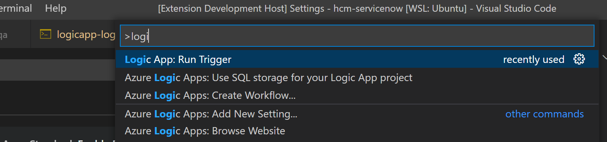
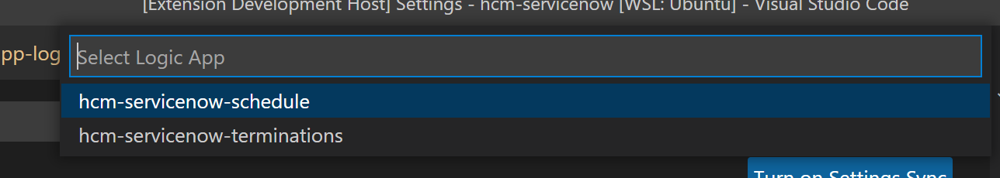
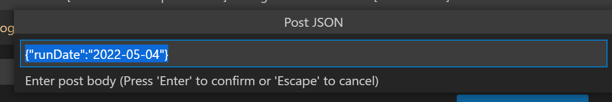

# Summary

The "logicapp-runner" allows you to run your Logic App Standard Single Tenant triggers for Recurrence and Request types (since GET Request and Recurrence triggers are not supported in the main Logic App Standard Single Tenant extension).

## Features

This extension adds a "Logic App: Run Trigger" option to the Command Pallette:

When you run the command, it will ask you to select from a list of workflows to run:

If the workflow selected has a trigger that requires a POST body, you will be promted to enter it:

## Requirements

This extension is built to be used in an Azure Logic Apps Standard Single-Tenant project.  It must be running (ie. in debug) in order to lookup the workflows and run the triggers.

Azure Logic Apps (Standard) VSCode Extension:  https://marketplace.visualstudio.com/items?itemName=ms-azuretools.vscode-azurelogicapps

How to Create Workflows with Single-Tenant Azure Logic Apps (Standard) in Visual Studio Code:

https://learn.microsoft.com/en-us/azure/logic-apps/create-single-tenant-workflows-visual-studio-code

## Extension Settings

This extension contributes the following settings:

* `logicapp-runner.baseUrl`: Default base URL of running Azure Logic App (default http://localhost:7071).

## Known Issues

* there are currently no known issues

## Release Notes

### 1.0.0

Initial release of logicapp-runner
